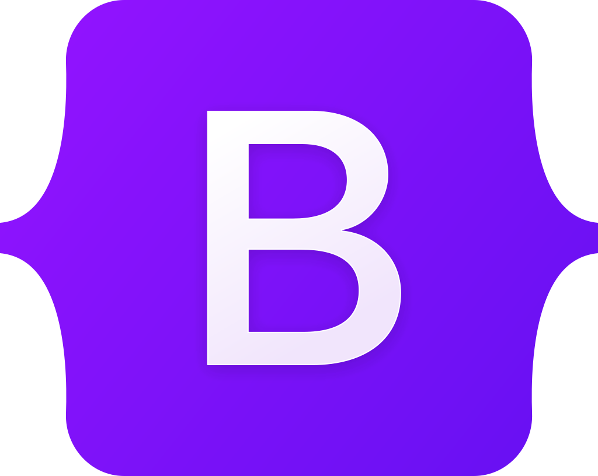

Hi there , I'am Rayhan!
==
Welcome to my profile, really happy when someone looks at my github :muscle::blush:

- :man_student: I'm a bachelor of informatics from [Mulawarman University](https://unmul.ac.id)
- :computer: I'm very interested in web programming :sunglasses:

- :open_file_folder: I have some course [certificates or certifications](https://github.com/handane/CERTIFICATE) that
you
might want to take a look at
 

### Languages and Tools:

   <code></code>
   <code></code>
   <code></code>
   <code></code>
   <code></code>
   <code></code>
   <code></code>

  

### Languages/Frameworks Currently learning:

   <code></code>
   <code></code>
<!--    <code></code> -->
   <code></code>
   <code></code>

  

 

   

### Find Me:

   
   

</h1>
